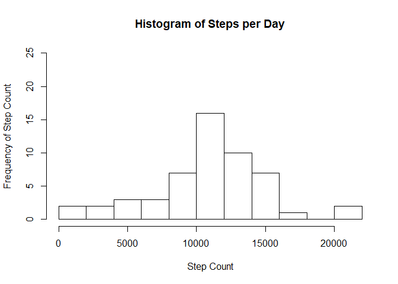
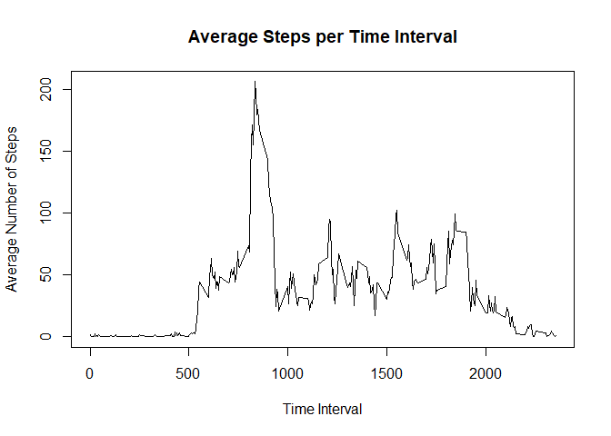
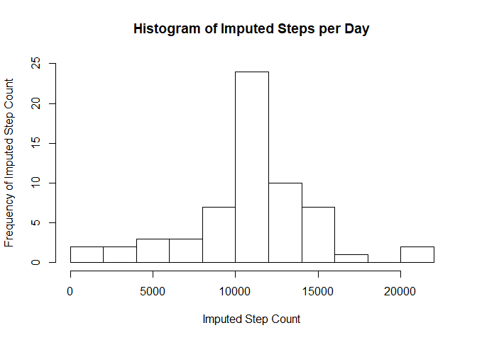
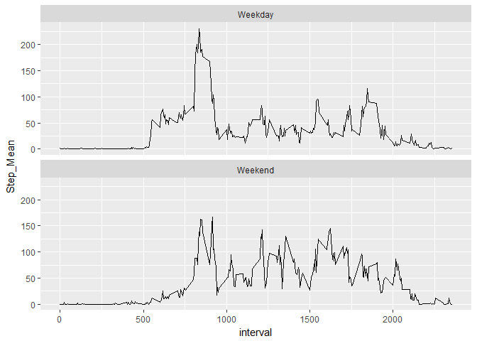

## Reading the dataset

The following code reads in the activity data from it's web location.


```r
temp <- tempfile(fileext = ".zip")
download.file("https://d396qusza40orc.cloudfront.net/repdata%2Fdata%2Factivity.zip", 
              temp)
activity <- read.csv(unzip(temp, exdir = tempdir()))
unlink(temp)
```

## Exploring Daily Activity

First we will look at the total, mean, and median steps per day for our dataset 
seen in the table below. For this section any row with a missing value will be 
removed prior to our analysis. Additionally, we will use things from the 
*tidyverse* and *knitr* packages.


```r
library(tidyverse)
library(knitr)
```

### Original Data Table

```r
activitynarm <- drop_na(activity, steps)
gdata <- activitynarm %>% group_by(date) %>% summarize(Step_Count = sum(steps), 
        Step_Mean = round(mean(steps), digits = 2), Step_Median = median(steps))
kable(gdata, "markdown", align = 'c')
```


|    date    | Step_Count | Step_Mean | Step_Median |
|:----------:|:----------:|:---------:|:-----------:|
| 2012-10-02 |    126     |   0.44    |      0      |
| 2012-10-03 |   11352    |   39.42   |      0      |
| 2012-10-04 |   12116    |   42.07   |      0      |
| 2012-10-05 |   13294    |   46.16   |      0      |
| 2012-10-06 |   15420    |   53.54   |      0      |
| 2012-10-07 |   11015    |   38.25   |      0      |
| 2012-10-09 |   12811    |   44.48   |      0      |
| 2012-10-10 |    9900    |   34.38   |      0      |
| 2012-10-11 |   10304    |   35.78   |      0      |
| 2012-10-12 |   17382    |   60.35   |      0      |
| 2012-10-13 |   12426    |   43.15   |      0      |
| 2012-10-14 |   15098    |   52.42   |      0      |
| 2012-10-15 |   10139    |   35.20   |      0      |
| 2012-10-16 |   15084    |   52.38   |      0      |
| 2012-10-17 |   13452    |   46.71   |      0      |
| 2012-10-18 |   10056    |   34.92   |      0      |
| 2012-10-19 |   11829    |   41.07   |      0      |
| 2012-10-20 |   10395    |   36.09   |      0      |
| 2012-10-21 |    8821    |   30.63   |      0      |
| 2012-10-22 |   13460    |   46.74   |      0      |
| 2012-10-23 |    8918    |   30.97   |      0      |
| 2012-10-24 |    8355    |   29.01   |      0      |
| 2012-10-25 |    2492    |   8.65    |      0      |
| 2012-10-26 |    6778    |   23.53   |      0      |
| 2012-10-27 |   10119    |   35.14   |      0      |
| 2012-10-28 |   11458    |   39.78   |      0      |
| 2012-10-29 |    5018    |   17.42   |      0      |
| 2012-10-30 |    9819    |   34.09   |      0      |
| 2012-10-31 |   15414    |   53.52   |      0      |
| 2012-11-02 |   10600    |   36.81   |      0      |
| 2012-11-03 |   10571    |   36.70   |      0      |
| 2012-11-05 |   10439    |   36.25   |      0      |
| 2012-11-06 |    8334    |   28.94   |      0      |
| 2012-11-07 |   12883    |   44.73   |      0      |
| 2012-11-08 |    3219    |   11.18   |      0      |
| 2012-11-11 |   12608    |   43.78   |      0      |
| 2012-11-12 |   10765    |   37.38   |      0      |
| 2012-11-13 |    7336    |   25.47   |      0      |
| 2012-11-15 |     41     |   0.14    |      0      |
| 2012-11-16 |    5441    |   18.89   |      0      |
| 2012-11-17 |   14339    |   49.79   |      0      |
| 2012-11-18 |   15110    |   52.47   |      0      |
| 2012-11-19 |    8841    |   30.70   |      0      |
| 2012-11-20 |    4472    |   15.53   |      0      |
| 2012-11-21 |   12787    |   44.40   |      0      |
| 2012-11-22 |   20427    |   70.93   |      0      |
| 2012-11-23 |   21194    |   73.59   |      0      |
| 2012-11-24 |   14478    |   50.27   |      0      |
| 2012-11-25 |   11834    |   41.09   |      0      |
| 2012-11-26 |   11162    |   38.76   |      0      |
| 2012-11-27 |   13646    |   47.38   |      0      |
| 2012-11-28 |   10183    |   35.36   |      0      |
| 2012-11-29 |    7047    |   24.47   |      0      |

Now we will produce a histogram of the total number of steps taken per day.


```r
hist(gdata$Step_Count, breaks = 15, main = "Histogram of Steps per Day", 
     xlab = "Step Count", ylab = "Frequency of Step Count", ylim = c(0,25))
```

<!-- -->

## Daily Activity Pattern

Now well will explore the distibution of steps by time interval. The data was 
originally collected in five minute blocks. Below is a chart that depicts the 
average steps per interval across all days of data.


```r
gdata1 <- activitynarm %>% group_by(interval) %>% 
    summarize(meanSteps = mean(steps))
plot(meanSteps ~ interval, data = gdata1, type = "l", 
     main = "Average Steps per Time Interval", xlab = "Time Interval",
     ylab = "Average Number of Steps")
```

<!-- -->

The time period with the largest average number of steps is starts at 835 
minutes.


```r
print(gdata1$interval[which.max(gdata1$meanSteps)])
```

```
## [1] 835
```

# Imputing Missing Values

If you explore the dataset you will discover that there are several instances of
"NA." 2304 occurances in fact.


```r
sum(is.na(activity))
```

```
## [1] 2304
```

The collowing code will impute the time interval mean into any areas that 
contain missing values. This is good because it does not bias the time interval
mean value; unfortunately, it will bias the time interval variance. Our new 
dataset is *imputeActivity.*


```r
intervalMean <- activity %>% group_by(interval) %>% summarize(steps =
    mean(steps,  na.rm = T))
stepsRep <- rep(intervalMean$steps,61)
naID <- which(is.na(activity$steps))
imputeActivity <- activity
imputeActivity[naID, "steps"] <- stepsRep[naID]
```

The next section will re-examine the dataset with the NA values replaced by the 
time interval mean.

### Imputed Data Table

```r
gdata2 <- imputeActivity %>% group_by(date) %>% summarize(Step_Count = sum(steps), 
        Step_Mean = round(mean(steps), digits = 2), Step_Median = median(steps))
kable(gdata2, "markdown", align = 'c', caption = "Imputed Dataset")
```


|    date    | Step_Count | Step_Mean | Step_Median |
|:----------:|:----------:|:---------:|:-----------:|
| 2012-10-01 |  10766.19  |   37.38   |  34.11321   |
| 2012-10-02 |   126.00   |   0.44    |   0.00000   |
| 2012-10-03 |  11352.00  |   39.42   |   0.00000   |
| 2012-10-04 |  12116.00  |   42.07   |   0.00000   |
| 2012-10-05 |  13294.00  |   46.16   |   0.00000   |
| 2012-10-06 |  15420.00  |   53.54   |   0.00000   |
| 2012-10-07 |  11015.00  |   38.25   |   0.00000   |
| 2012-10-08 |  10766.19  |   37.38   |  34.11321   |
| 2012-10-09 |  12811.00  |   44.48   |   0.00000   |
| 2012-10-10 |  9900.00   |   34.38   |   0.00000   |
| 2012-10-11 |  10304.00  |   35.78   |   0.00000   |
| 2012-10-12 |  17382.00  |   60.35   |   0.00000   |
| 2012-10-13 |  12426.00  |   43.15   |   0.00000   |
| 2012-10-14 |  15098.00  |   52.42   |   0.00000   |
| 2012-10-15 |  10139.00  |   35.20   |   0.00000   |
| 2012-10-16 |  15084.00  |   52.38   |   0.00000   |
| 2012-10-17 |  13452.00  |   46.71   |   0.00000   |
| 2012-10-18 |  10056.00  |   34.92   |   0.00000   |
| 2012-10-19 |  11829.00  |   41.07   |   0.00000   |
| 2012-10-20 |  10395.00  |   36.09   |   0.00000   |
| 2012-10-21 |  8821.00   |   30.63   |   0.00000   |
| 2012-10-22 |  13460.00  |   46.74   |   0.00000   |
| 2012-10-23 |  8918.00   |   30.97   |   0.00000   |
| 2012-10-24 |  8355.00   |   29.01   |   0.00000   |
| 2012-10-25 |  2492.00   |   8.65    |   0.00000   |
| 2012-10-26 |  6778.00   |   23.53   |   0.00000   |
| 2012-10-27 |  10119.00  |   35.14   |   0.00000   |
| 2012-10-28 |  11458.00  |   39.78   |   0.00000   |
| 2012-10-29 |  5018.00   |   17.42   |   0.00000   |
| 2012-10-30 |  9819.00   |   34.09   |   0.00000   |
| 2012-10-31 |  15414.00  |   53.52   |   0.00000   |
| 2012-11-01 |  10766.19  |   37.38   |  34.11321   |
| 2012-11-02 |  10600.00  |   36.81   |   0.00000   |
| 2012-11-03 |  10571.00  |   36.70   |   0.00000   |
| 2012-11-04 |  10766.19  |   37.38   |  34.11321   |
| 2012-11-05 |  10439.00  |   36.25   |   0.00000   |
| 2012-11-06 |  8334.00   |   28.94   |   0.00000   |
| 2012-11-07 |  12883.00  |   44.73   |   0.00000   |
| 2012-11-08 |  3219.00   |   11.18   |   0.00000   |
| 2012-11-09 |  10766.19  |   37.38   |  34.11321   |
| 2012-11-10 |  10766.19  |   37.38   |  34.11321   |
| 2012-11-11 |  12608.00  |   43.78   |   0.00000   |
| 2012-11-12 |  10765.00  |   37.38   |   0.00000   |
| 2012-11-13 |  7336.00   |   25.47   |   0.00000   |
| 2012-11-14 |  10766.19  |   37.38   |  34.11321   |
| 2012-11-15 |   41.00    |   0.14    |   0.00000   |
| 2012-11-16 |  5441.00   |   18.89   |   0.00000   |
| 2012-11-17 |  14339.00  |   49.79   |   0.00000   |
| 2012-11-18 |  15110.00  |   52.47   |   0.00000   |
| 2012-11-19 |  8841.00   |   30.70   |   0.00000   |
| 2012-11-20 |  4472.00   |   15.53   |   0.00000   |
| 2012-11-21 |  12787.00  |   44.40   |   0.00000   |
| 2012-11-22 |  20427.00  |   70.93   |   0.00000   |
| 2012-11-23 |  21194.00  |   73.59   |   0.00000   |
| 2012-11-24 |  14478.00  |   50.27   |   0.00000   |
| 2012-11-25 |  11834.00  |   41.09   |   0.00000   |
| 2012-11-26 |  11162.00  |   38.76   |   0.00000   |
| 2012-11-27 |  13646.00  |   47.38   |   0.00000   |
| 2012-11-28 |  10183.00  |   35.36   |   0.00000   |
| 2012-11-29 |  7047.00   |   24.47   |   0.00000   |
| 2012-11-30 |  10766.19  |   37.38   |  34.11321   |

Comparing the two data tables it is clear that there was no change to the 
step means. That is expected because of the techinique used to impute the 
missing data does not bias the mean. It does, however, greatly impact the median 
producing the only values greater than 0. This is because all the time intervals 
have a value now based on the mean for that interval. Additionally, each of the 
imputed medians are equal to 34.11 because they are all calculated from the 
same data set. Below is a histogram based upon the imputed data set. Note that 
the bar at the 10000 step level had an increase of eight, the number of dates 
with missing data. All the imputed days 
increased the count for the mean which happens to be just above the 10000 
count.


```r
hist(gdata2$Step_Count, breaks = 15, main = "Histogram of Imputed Steps per Day", 
     xlab = "Imputed Step Count", ylab = "Frequency of Imputed Step Count",
     ylim = c(0,25))
```

<!-- -->

## Differences Between Weekdays and Weekends

The final piece of exploration we will complete is determingin if any 
differences exist between steps during weekdays and weekends. For this analysis 
the dataset containing the imputed data is used. The code below identifies the 
day of the week for each date, identifies it as either a weekend or 
weekday, and finally groups the steps per time interval based on it being a 
weekend or weekday.


```r
dayData <- imputeActivity
dayData$day <- weekdays(as.POSIXlt(imputeActivity$date))
dayData$dayType <- ifelse(dayData$day %in% c("Saturday", "Sunday"), "Weekend", 
                          "Weekday")
gdata3 <- dayData %>% group_by(interval, dayType) %>% summarize(Step_Mean = 
                        round(mean(steps), digits = 2))
```

Now that the data is properly grouped a time-series plot ir produced below. What it shows is that during the week there is a large, initial spike followed by numbers bewteen 25 and 100 steps per interval. During the weekend there is no major spike but the range of steps is generally higher between 50 and 150 per interval. 


```r
ggplot(gdata3, aes(x=interval, y = Step_Mean))+geom_line() + facet_wrap(~dayType, dir = "v")
```

<!-- -->

